# **Build a Traffic Sign Recognition Project**

The goals / steps of this project are the following:
* Load the data set (see below for links to the project data set)
* Explore, summarize and visualize the data set
* Design, train and test a model architecture
* Use the model to make predictions on new images
* Analyze the softmax probabilities of the new images
* Summarize the results with a written report

## Writeup / README

Important Links:  
- [project code](https://github.com/sistelexis/trafficSignClassifier/blob/master/Traffic_Sign_Classifier.ipynb)  
- [GitHub folder](https://github.com/sistelexis/trafficSignClassifier)  

## Rubric Points
Here I will consider the rubric points individually and describe how I addressed each point in my implementation.  

### Load the data set (see below for links to the project data set)
One important detail was to load, besides the images and the labels, the zoom information in order to use it later for data augmentation.
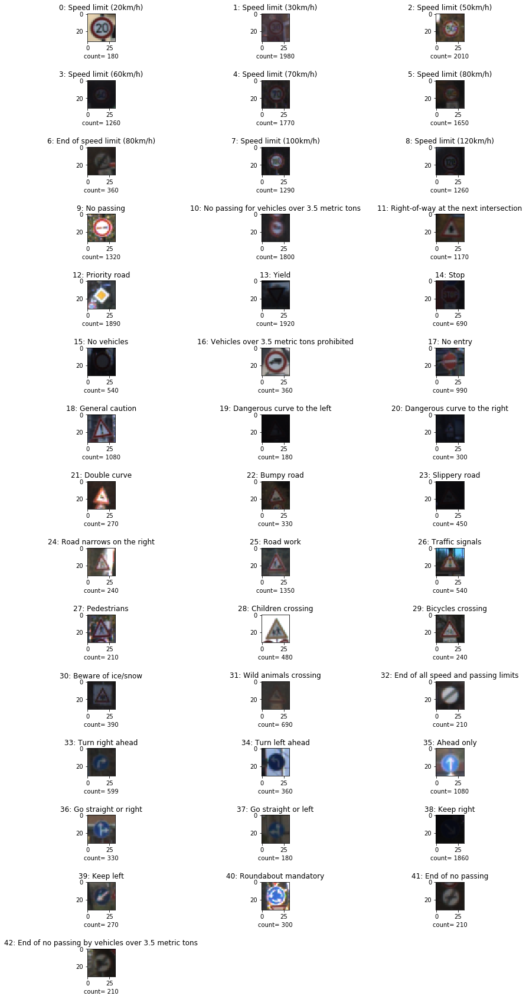

### Explore, summarize and visualize the data set
The data sets have the following amount of images:
* Number of training examples = 34799
* Number of validation examples = 4410
* Number of testing examples = 12630
* Images are 32 x 32 RGB.
* There are 43 different signs type.  

Looking at the data sets, we can easily see that image count per sign class is very uneven. In fact, some signs are represented over 10 times more than others. That distribution is the same on all the three data sets.

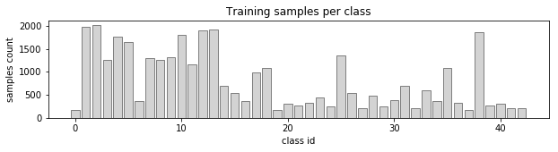

### Design, train and test a model architecture
In order to feed the model, the first step was to pre-process the images.  

Although I have tried several approaches, I finally decided to simply use a grayscale conversion, followed by the normalization.
With that action, I intended to focus on finetuning the model parameters. For instance, I realized that the histogram equalization was having a strange effect like removing a lot of information, and having an effect like a dropout, but in a way not as random as a dropout, and that affected the results.  

As an example, some speed limit signs could totally loose the number.  
The bellow images shows different states of processing that led me to choose only grayscale. In order to show the effects of the pre-processing, I choose some images heavily affected by it (list order matches columns):  

1. Original color image
2. Grayscale transformation
3. Equalized histogram
4. Sharpen over grayscale
5. Sharpen over equalized histogram

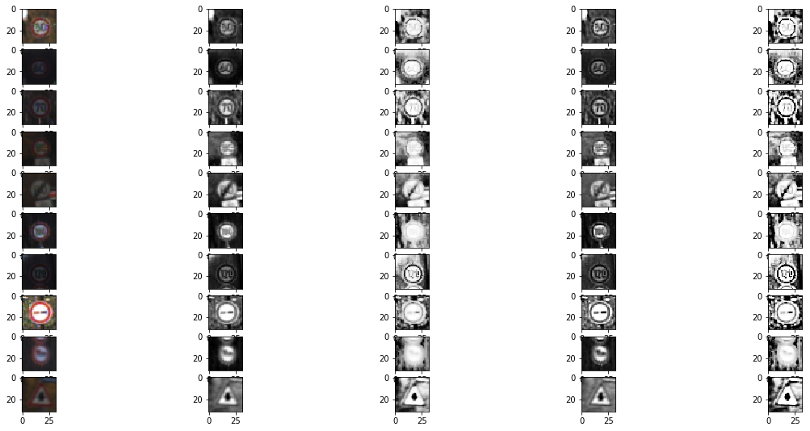

On the code notebook other tests can be found.

Next step was the data augmentation, and I did it in two sub-steps.  

Since I had the right zoom information from the data set, I simply duplicated the amount of images using that information.  

Then, in order to level the number of images per sign class, I randomly applied rotation, translation, distortion and brightness adjustment, to each sign type until each one reached 2020 x 2 images (a little bit over the counting of the most represented sign, after being duplicated using the zoom). That created a total number of images of around 175k.  

Finally, starting from the suggested LeNet model, that was from scratch only a few 4 or 5% away from the required value (I must admit, that later I have to fight it hard to get there. So those few turned out to be a lot), I started my learning process to understand how the model would manage to achieve the required test accuracy of 93%.  

To train the model, I made some tests to identify an acceptable learning rate, using the batch size of 128 already coming from the LeNet project. I also maintained the Adam Optimizer.  

I then understood that I should overfit the model. To achieve it, I started adding filters to the existing layers and started seeing some good improvements. Then I finally added a third convolution layer.  

The final model has one more convolution (3x3) than the LeNet, more filters, and two dropouts after fully connected layers (0 and 1).  

My final model consisted of the following layers:

| Layer         		|     Description	        					| 
|:---------------------:|:---------------------------------------------:| 
| Input         		| 32x32x1 grayscale image   					| 
| Convolution 5x5     	| 1x1 stride, valid padding, outputs 32x32x12 	|
| RELU					|												|
| Max pooling	      	| 2x2 stride,  outputs 14x14x12 				|
| Convolution 5x5     	| 1x1 stride, valid padding, outputs 10x10x32 	|
| RELU					|												|
| Max pooling	      	| 2x2 stride,  outputs 5x5x32 				    |
| Convolution 3x3	    | 1x1 stride, valid padding, outputs 3x3x64 	|
| RELU					|												|
| Fully connected		| outputs 576        							|
| Droptout				| 0.7											|
| Fully connected		| outputs 256        							|
| RELU					|												|
| Droptout				| 0.7											|
| Fully connected		| outputs 84        							|
| RELU					|												|
| Fully connected		| outputs 43        							|  

Since the results were getting quite near the required value, and the curves were displaying a good slope, I increased epochs from 20 to 200. 

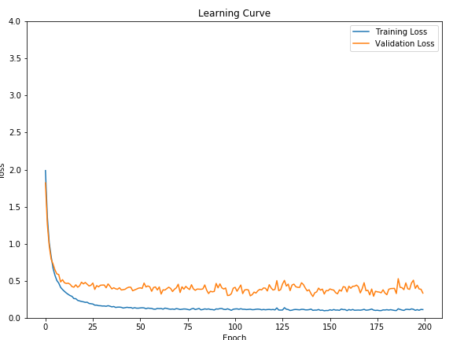
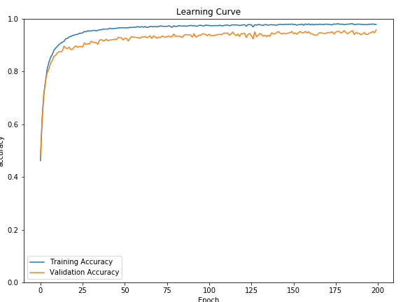

My final model results were:
* training set accuracy of 98%  
* validation set accuracy of 96% 
* test set accuracy of 93%

### Use the model to make predictions on new images
In order to be as realistic as it could be, I used Goolgle Earth Street View from German roads (around Cologne and in front of the train station at Frankfurt) to collect signs in a real situation. The signs have all been correctly indentified, as it can be seen on the images below.

<table border="0"><tr><td>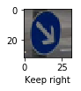</td><td>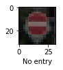</td><td>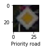</td><td>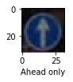</td><td>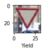</td><td>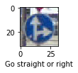</td></tr></table>

Here are the results of the prediction:

| Image			        |     Prediction	        					| 
|:---------------------:|:---------------------------------------------:| 
| Keep right         	| Keep right   									| 
| No entry     			| No entry 										|
| Priority road			| Priority road									|
| Ahead only      		| Ahead only			 						|
| Yield					| Yield 		     							|
| Go straight or right	| Go straight or right 							|

The model was able to correctly guess 6 of the 6 traffic signs, which gives an accuracy of 100%. 

### Analyze the softmax probabilities of the new images
The model has identified the signs with probabilities from 50 to 80%. The second options had probabilities between 5 and 20%.

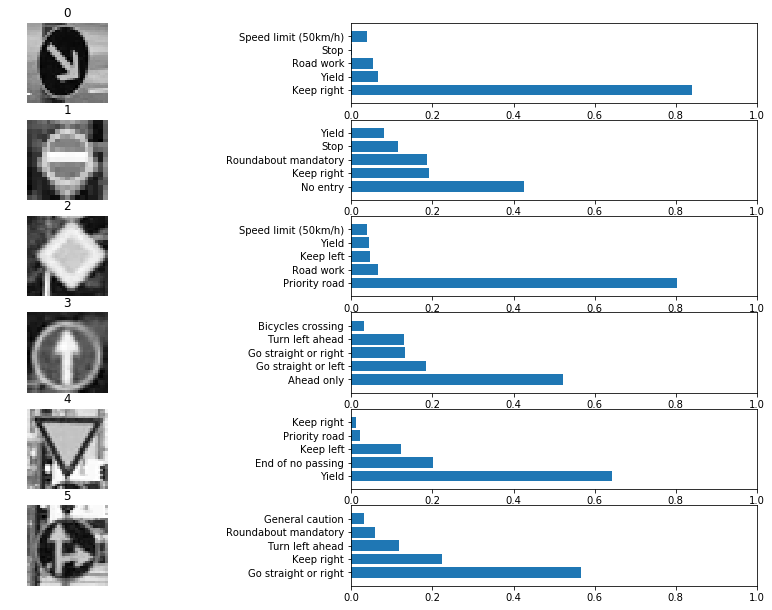

### Summarize the results with a written report
To achieve the 93% accuracy for the test set, I had to test different parameters until it became clear what will provide better results.  

All those tests have shown that tiny differences might cause big differences on the output. A mistake that I later realized, is that at first I tried to go to fast, changing more than one variable at a time (although it did seem logical at that time).
I would now say that the best approach is to keep it as simple as possible, and then step by step to chase a huge training accuracy. That huge value, once found, can be "shared" with the validation, with the help of dropouts, allowing a suitable value based on the project requirements.  

With the right balancing of all those parameters, the 93% value on the test evaluation have finally been achieved.  

Besides that result, achieving 100% of accuracy on the signs collected from German roads (using the Google Earth street view) shows that the model really works.

### (Optional) Visualizing the Neural Network (See Step 4 of the Ipython notebook for more details)

As it can be seen on the images below, we can see the features focuses on highly contrasted details like the border of the sign as well as the symbols on the sign.

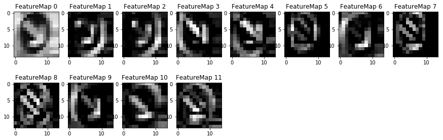

---